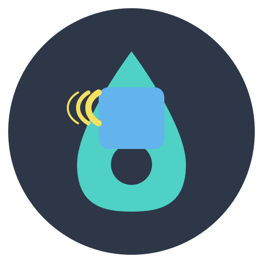

#  Askarr

<div align="center">
  
  
  <h3>🤖 Your Media Server's Personal Assistant</h3>
  <p>Request movies, TV shows, and music directly from Discord or Telegram</p>
  
  [](https://hub.docker.com/r/amazingmoaaz/askarr)
  [](https://github.com/AmazingMoaaz/Askarr)
  [](https://github.com/AmazingMoaaz/Askarr/releases)
  [](https://github.com/AmazingMoaaz/Askarr/blob/master/LICENSE)
</div>

---

## 🚀 What is Askarr?

Askarr bridges your media ecosystem with chat platforms, allowing users to **request content, manage libraries, and receive notifications** through Discord or Telegram. No more switching between apps—your entire media server is just a message away.

<div align="center">
  
| 💬 **Chat Platforms** | 📺 **Media Servers** | 🎯 **Request Systems** |
|:---:|:---:|:---:|
| Discord • Telegram | Sonarr • Radarr • Lidarr | Overseerr • Ombi |

</div>

---

## ✨ Key Features

<table>
<tr>
<td width="50%" valign="top">

### 💬 Chat Integration
- **Discord**: Slash commands, rich embeds, role permissions
- **Telegram**: Inline keyboards, group support, dynamic help
- **Interactive**: Button controls for selections and confirmations
- **Smart**: Context-aware commands with autocomplete

</td>
<td width="50%" valign="top">

### 🎬 Media Management
- **Movies**: Radarr V2-V5 with 4K/1080p profiles
- **TV Shows**: Sonarr V2-V4 with season control
- **Music**: Lidarr V1-V2 for artists and albums
- **Quality**: Multiple profiles and instance support

</td>
</tr>
<tr>
<td width="50%" valign="top">

### 🎯 Request Systems
- **Overseerr**: Elegant UI, advanced permissions
- **Ombi**: V3/V4 support, quota management
- **Permissions**: Role-based access control
- **Quotas**: Limit requests per user/period

</td>
<td width="50%" valign="top">

### ⚙️ Administration
- **Web Panel**: Modern, responsive UI (v2.5.3)
- **Real-time**: Live status and monitoring
- **Notifications**: Custom alerts for users
- **Docker**: Single container deployment

</td>
</tr>
</table>

---

## 🐳 Quick Start

### Docker (Recommended)

```bash
docker run -d \
  --name askarr \
  -p 4545:4545 \
  -v ./config:/root/config \
  -v ./tmp:/root/tmp \
  --restart unless-stopped \
  amazingmoaaz/askarr:latest
```

### Docker Compose

```yaml
services:
  askarr:
    image: amazingmoaaz/askarr:latest
    container_name: askarr
    ports:
      - "4545:4545"
    volumes:
      - ./config:/root/config
      - ./tmp:/root/tmp
    restart: unless-stopped
```

<div align="center">
  
**🌐 Access the web interface at:** [`http://localhost:4545`](http://localhost:4545)

</div>

---

## 📖 Setup Guide

1. **Start Askarr** using Docker command above
2. **Open web interface** and create admin account
3. **Configure chat client** (Discord bot token or Telegram token)
4. **Add media servers** (Radarr, Sonarr, Lidarr)
5. **Set permissions** for users/roles
6. **Start requesting!** 🎉

<div align="center">
  
📚 **[Full Documentation](https://github.com/AmazingMoaaz/Askarr/wiki)** • 🐛 **[Report Issues](https://github.com/AmazingMoaaz/Askarr/issues)** • 💬 **[Join Discord](https://discord.gg/askarr)**

</div>

---

## 🎨 Screenshots

<div align="center">
  
  
  
</div>

> Beautiful, modern interface with glassmorphic design and smooth animations

---

## 🔄 Updates & Versioning

Askarr follows [Semantic Versioning](https://semver.org/): `MAJOR.MINOR.PATCH`

| Tag | Description | Example |
|-----|-------------|---------|
| `latest` | Latest stable release | Always up-to-date |
| `X.Y.Z` | Specific version | `2.5.3` |
| `X.Y` | Major.Minor version | `2.5` |

**Update to latest:**
```bash
docker pull amazingmoaaz/askarr:latest
docker restart askarr
```

> ⚠️ **Data Persistence**: Always use volumes for `/root/config` and `/root/tmp` to keep settings across updates!

---

## 🛠️ Development

### Building from Source

```bash
# Clone repository
git clone https://github.com/AmazingMoaaz/Askarr.git
cd Askarr

# Build Docker image
docker build -t askarr:local -f Askarr.WebApi/dockerfile .

# Or run locally (requires .NET 6 SDK and Node.js 18+)
cd Askarr.WebApi
dotnet run
```

### Tech Stack

- **Backend**: ASP.NET Core 6.0 (C#)
- **Frontend**: React 18, Redux, Reactstrap
- **Chat**: DSharpPlus (Discord), Telegram.Bot
- **Styling**: SCSS with modern glassmorphism
- **Deployment**: Docker multi-stage builds

---

## 🌟 Community & Support

<div align="center">
  <table>
    <tr>
      <td align="center" width="33%">
        <a href="https://discord.gg/askarr">
          
        </a>
        <br><sub>Get help from the community</sub>
      </td>
      <td align="center" width="33%">
        <a href="https://github.com/AmazingMoaaz/Askarr/wiki">
          
        </a>
        <br><sub>Comprehensive guides</sub>
      </td>
      <td align="center" width="33%">
        <a href="https://github.com/AmazingMoaaz/Askarr/issues">
          
        </a>
        <br><sub>Found a problem?</sub>
      </td>
    </tr>
  </table>
</div>

---

## 💖 Acknowledgements

Askarr builds on the legacy of **Requestrr**, continuing its mission with modern enhancements.

<div align="center">
  <table>
    <tr>
      <td align="center">
        
        <br><a href="https://github.com/darkalfx"><b>@darkalfx</b></a>
        <br><sub>Requestrr Creator</sub>
      </td>
      <td align="center">
        
        <br><a href="https://github.com/thomst08"><b>@thomst08</b></a>
        <br><sub>Requestrr Maintainer</sub>
      </td>
    </tr>
  </table>
  
  <br>
  
  **Thank you to all contributors and users! ⭐**
  
  <a href="https://github.com/AmazingMoaaz/Askarr/stargazers">
    
  </a>
</div>

---

<div align="center">
  <sub>Built with ❤️ by <a href="https://github.com/AmazingMoaaz">@AmazingMoaaz</a></sub>
  <br>
  <sub>Licensed under MIT • Version 2.5.3</sub>
</div>
